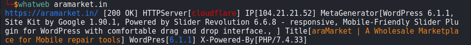

# whatweb

Next generation web scanner

 [](https://pypi.org/project/whatweb/)
 [](https://pepy.tech/project/whatweb)
 [](https://pepy.tech/project/whatweb)
 
 
 
 


## Installation

```sh
pip3 install whatweb
```

## Usage 
```sh
whatweb {target}           # Enter URL, hostname, IP address
```

## Demo


